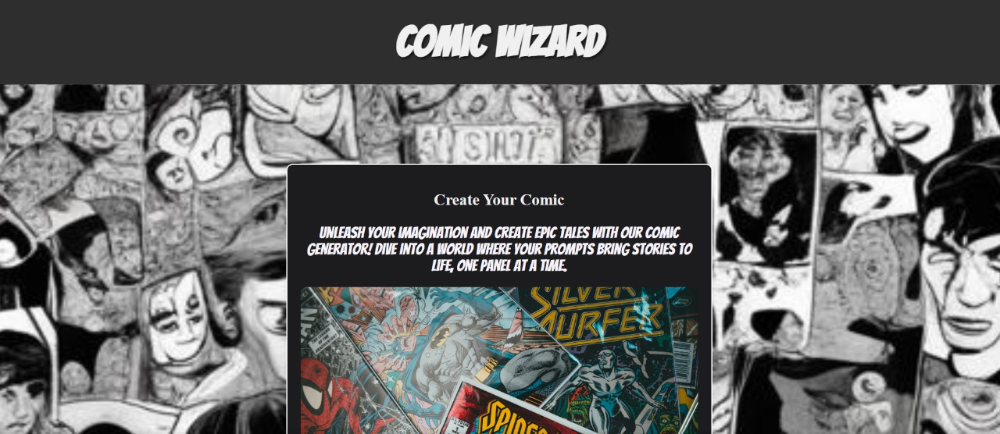
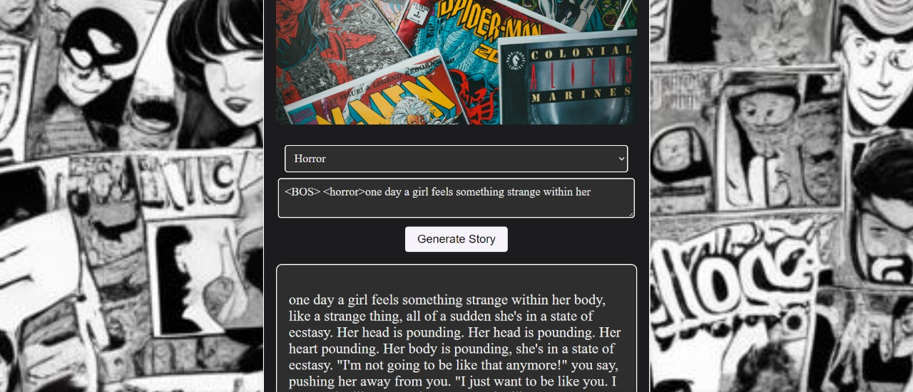
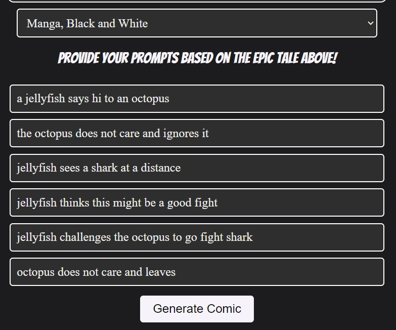
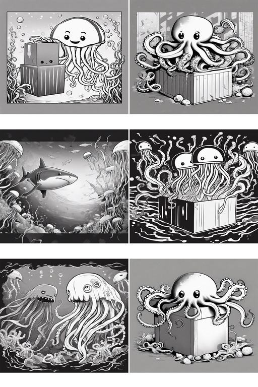
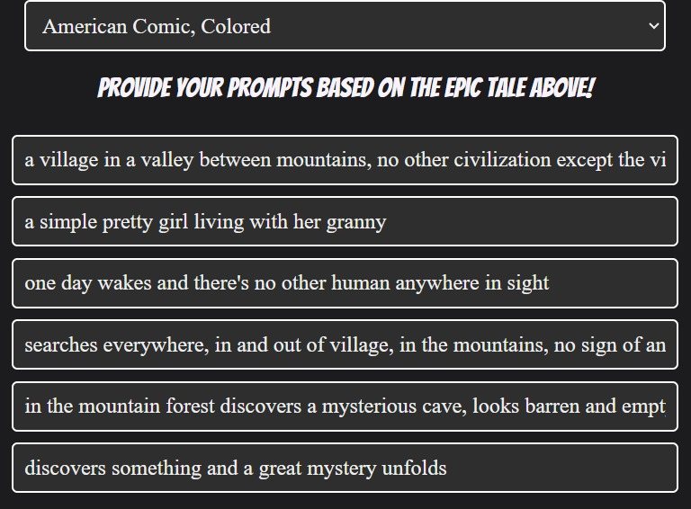
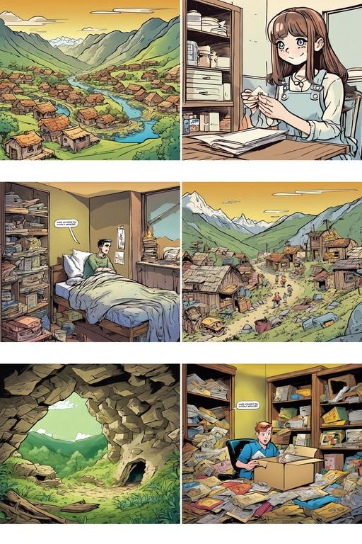

# AI Comic Generator

## Overview

The AI Comic Generator is a web application that allows users to create personalized comic strips based on their inputs. Utilizing GPT-2 for story generation and Stability for comic rendering, this tool provides an engaging and creative experience for users to bring their stories to life in a visual format. Due to subscription limitations, GPT-2 was used instead of GPT-4, with an innovative approach to generate stories and comic panels from user prompts.

## Features

- **Genre Selection**: Choose from various genres like Superhero, Action, Drama, Horror, Thriller, and Sci-Fi.
- **Story Generation**: Input a single-line prompt to generate a complete story based on the selected genre.
- **Comic Art Style**: Select from different comic art styles including American Comic (Colored), Manga (Black and White), and Cartoonish (Vibrant Colors).
- **Prompt-Based Comic Panels**: Provide six prompts based on the generated story to create personalized comic strips.

## Technologies Used

- **Python**: Backend logic and Flask framework.
- **Flask**: Web framework to serve the application.
- **GPT-2**: Used for generating stories from user inputs.
- **Stability**: Used for rendering comic images based on prompts.
- **HTML/CSS/JavaScript**: Frontend design and interactions.
- **PIL (Python Imaging Library)**: Image processing for comic panels.

## Installation

1. **Clone the Repository**:
    ```bash
    git clone https://github.com/your-username/ai-comic-generator.git
    cd ai-comic-generator
    ```

2. **Create and Activate Virtual Environment**:
    ```bash
    python3 -m venv venv
    source venv/bin/activate   # On Windows, use `venv\Scripts\activate`
    ```

3. **Install Dependencies**:
    ```bash
    pip install -r requirements.txt
    ```

4. **Run the Application**:
    ```bash
    python app.py
    ```

5. **Access the Application**:
    Open your browser and navigate to `http://127.0.0.1:5000`.

## Usage

1. **Select Genre**:
    Choose your desired genre from the dropdown menu.

2. **Generate Story**:
    Enter a single-line prompt and click "Generate Story" to create a full story.

3. **Choose Comic Art Style**:
    Select your preferred comic art style.

4. **Provide Prompts**:
    Based on the generated story, enter six prompts to guide the comic creation process.

5. **Generate Comic**:
    Click "Generate Comic" to create your personalized comic strip.

## Screenshots







## Contributing

Contributions are welcome! Please feel free to submit a Pull Request.

## License

This project is licensed under the MIT License. See the [LICENSE](LICENSE) file for more details.


 
